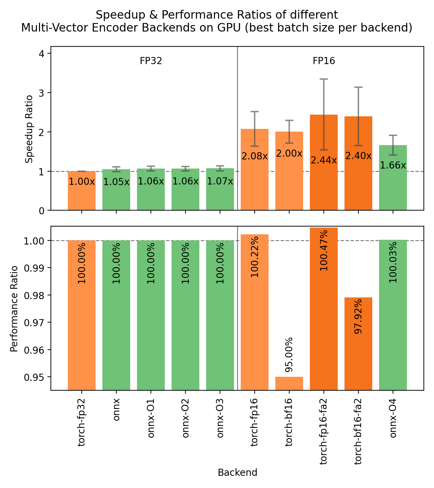
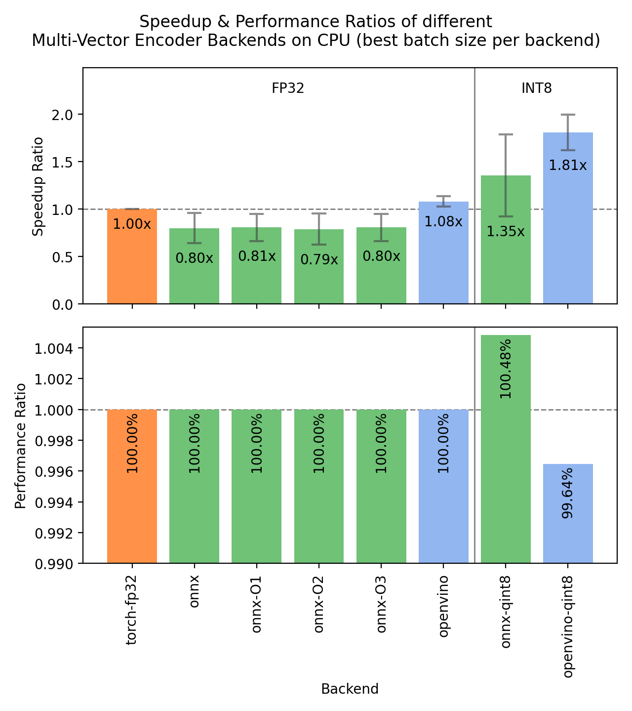

Speeding up Inference
=====================

Sentence Transformers supports 3 backends for computing multi-vector embeddings with Multi-Vector Encoder models, each with its own optimizations for speeding up inference:

.. raw:: html

    

        <a href="#pytorch" class="box">
            
PyTorch

            The default backend for Multi-Vector Encoders.
        </a>
        <a href="#onnx" class="box">
            
ONNX

            Flexible and efficient model accelerator.
        </a>
        <a href="#openvino" class="box">
            
OpenVINO

            Optimization of models, mainly for Intel Hardware.
        </a>
        <a href="#benchmarks" class="box">
            
Benchmarks

            Benchmarks for the different backends.
        </a>
        <a href="#user-interface" class="box">
            
User Interface

            GUI to export, optimize, and quantize models.
        </a>
    

     

PyTorch
-------

The PyTorch backend is the default backend for Multi-Vector Encoders. If you don't specify a device, it will use the strongest available option across "cuda", "mps", and "cpu". Its default usage looks like this:

.. code-block:: python

   from sentence_transformers import MultiVectorEncoder

   model = MultiVectorEncoder("mixedbread-ai/mxbai-edge-colbert-v0-32m")

   queries = ["What is the capital of France?"]
   documents = [
       "Paris is the capital of France.",
       "Berlin is the capital of Germany.",
   ]

   query_embeddings = model.encode_query(queries)
   document_embeddings = model.encode_document(documents)

   scores = model.similarity(query_embeddings, document_embeddings)
   print(scores)
   # tensor([[10.6578, 10.4499]])

If you're using a GPU, then you can use the following options to speed up your inference:

.. tab:: float16 (fp16)

   Float32 (fp32, full precision) is the default floating-point format in ``torch``, whereas float16 (fp16, half precision) is a reduced-precision floating-point format that can speed up inference on GPUs at a minimal loss of model accuracy. To use it, you can specify the ``torch_dtype`` during initialization or call :meth:`model.half() <torch.Tensor.half>` on the initialized model:

   .. code-block:: python

      from sentence_transformers import MultiVectorEncoder

      model = MultiVectorEncoder("mixedbread-ai/mxbai-edge-colbert-v0-32m", model_kwargs={"torch_dtype": "float16"})
      # or: model.half()

      documents = [
          "Paris is the capital of France.",
          "Berlin is the capital of Germany.",
      ]
      document_embeddings = model.encode_document(documents)

.. tab:: bfloat16 (bf16)

   Bfloat16 (bf16) is similar to fp16, but preserves more of the original accuracy of fp32. To use it, you can specify the ``torch_dtype`` during initialization or call :meth:`model.bfloat16() <torch.Tensor.bfloat16>` on the initialized model:

   .. code-block:: python

      from sentence_transformers import MultiVectorEncoder

      model = MultiVectorEncoder("mixedbread-ai/mxbai-edge-colbert-v0-32m", model_kwargs={"torch_dtype": "bfloat16"})
      # or: model.bfloat16()

      documents = [
          "Paris is the capital of France.",
          "Berlin is the capital of Germany.",
      ]
      document_embeddings = model.encode_document(documents)

.. tab:: Flash Attention

   `Flash Attention <https://github.com/Dao-AILab/flash-attention>`_ is an efficient attention implementation that can significantly
   speed up inference on GPUs. When flash attention with variable-length support is available, Sentence Transformers automatically
   skips padding for text-only inputs by concatenating them into a single sequence. This is especially beneficial for
   Multi-Vector Encoders, as documents are only truncated (not padded) to a shared length, so batch lengths vary widely.

   To use flash attention, specify ``attn_implementation="flash_attention_2"`` in ``model_kwargs``. Flash attention can be installed
   via ``pip install kernels``, which provides flash attention support without needing the ``flash-attn`` package, or alternatively
   via ``pip install flash-attn``. In our benchmarks below, combining it with fp16 was the fastest configuration measured
   (2.44x over fp32) at no loss of retrieval quality:

   .. code-block:: python

      from sentence_transformers import MultiVectorEncoder

      model = MultiVectorEncoder(
          "lightonai/GTE-ModernColBERT-v1",
          model_kwargs={"attn_implementation": "flash_attention_2", "torch_dtype": "float16"},
      )

      documents = [
          "Paris is the capital of France.",
          "Berlin is the capital of Germany.",
      ]
      document_embeddings = model.encode_document(documents)

   .. warning::

      Models with ``pad_skip`` query expansion (e.g. Stanford-NLP checkpoints like ``colbert-ir/colbertv2.0`` and
      ``answerdotai/answerai-colbert-small-v1``) reject Flash Attention at load time: Flash Attention strips
      ``attention_mask=0`` positions, so the ``[MASK]`` expansion tokens used by MaxSim would never receive an
      attention update. For those models, use ``"sdpa"`` (preserves semantics) or switch the model to
      ``query_expansion={"strategy": "pad_attend", ...}`` (changes semantics, requires re-evaluation). Models with
      ``pad_attend`` expansion (e.g. ``lightonai/GTE-ModernColBERT-v1``) work with Flash Attention out of the box.

   Input unpadding can be controlled via :attr:`~sentence_transformers.base.modules.transformer.Transformer.unpad_inputs`
   on the underlying :class:`~sentence_transformers.base.modules.transformer.Transformer` module:

   .. code-block:: python

      model[0].unpad_inputs = False   # Force padding
      model[0].unpad_inputs = True    # Explicitly request unpadding
      model[0].unpad_inputs = None    # Auto-detect (default)

   Input flattening also speeds up training. When training with
   :class:`~sentence_transformers.multi_vector_encoder.losses.CachedMultiVectorMultipleNegativesRankingLoss`, you can
   set ``mini_batch_num_tokens`` instead of ``mini_batch_size``: mini-batches are then packed by total token count
   rather than by sequence count, so every mini-batch performs a similar amount of work and uses a similar, predictable
   amount of memory, regardless of how sequence lengths are distributed within the batch.

.. tab:: torch.compile

   :meth:`model.compile() <sentence_transformers.base.model.BaseModel.compile>` wraps the model's forward pass with
   :func:`torch.compile`. Whether it helps depends strongly on the model and hardware: the benefit grows with model
   size, and very small models on a fast GPU can see little gain or even a slight slowdown, since their inference is
   dominated by tokenization and Python overhead. Always measure on your own model, hardware, and inputs. It composes
   with the fp16/bf16 options above.

   .. code-block:: python

      from sentence_transformers import MultiVectorEncoder

      model = MultiVectorEncoder("mixedbread-ai/mxbai-edge-colbert-v0-32m", model_kwargs={"torch_dtype": "bfloat16"})
      model.compile(dynamic=True)

      documents = [
          "Paris is the capital of France.",
          "Berlin is the capital of Germany.",
      ]
      document_embeddings = model.encode_document(documents)

   ``dynamic=True`` enables dynamic shapes so a compiled graph can handle variable sequence lengths, reducing
   recompilation when your inputs vary in length. This matters more for Multi-Vector Encoders than for single-vector
   models, as documents are only truncated (not padded) to a shared length. Compilation is lazy, so warm the model up
   on representative inputs before benchmarking or serving.

ONNX
----

ONNX can be used to speed up inference by converting the model to ONNX format and using ONNX Runtime to run the model. To use the ONNX backend, you must install Sentence Transformers with the ``onnx`` or ``onnx-gpu`` extra for CPU or GPU acceleration, respectively:

.. code-block:: bash

   pip install sentence-transformers[onnx-gpu]
   # or
   pip install sentence-transformers[onnx]

To convert a model to ONNX format, you can use the following code:

.. code-block:: python

   from sentence_transformers import MultiVectorEncoder

   model = MultiVectorEncoder("mixedbread-ai/mxbai-edge-colbert-v0-32m", backend="onnx")

   queries = ["What is the capital of France?"]
   documents = [
       "Paris is the capital of France.",
       "Berlin is the capital of Germany.",
   ]

   query_embeddings = model.encode_query(queries)
   document_embeddings = model.encode_document(documents)

   scores = model.similarity(query_embeddings, document_embeddings)
   print(scores)
   # tensor([[10.6578, 10.4499]])

If the model path or repository already contains a model in ONNX format, Sentence Transformers will automatically use it. Otherwise, it will convert the model to the ONNX format.

.. note::

   The ONNX export only converts the Transformer component, which outputs contextualized token embeddings. The remaining pipeline modules (the projection to the multi-vector dimension, the scoring mask, and the token-level normalization) run in PyTorch on top of it, and the query/document length caps and query expansion are applied during tokenization. As a result, all backends produce identical embeddings, but if you wish to use the ONNX model outside of Sentence Transformers, you'll need to apply those steps yourself.

All keyword arguments passed via ``model_kwargs`` will be passed on to :meth:`ORTModel.from_pretrained <optimum.onnxruntime.ORTModel.from_pretrained>`. Some notable arguments include:

* ``provider``: ONNX Runtime provider to use for loading the model, e.g. ``"CPUExecutionProvider"`` . See https://onnxruntime.ai/docs/execution-providers/ for possible providers. If not specified, the strongest provider (E.g. ``"CUDAExecutionProvider"``) will be used.
* ``file_name``: The name of the ONNX file to load. If not specified, will default to ``"model.onnx"`` or otherwise ``"onnx/model.onnx"``. This argument is useful for specifying optimized or quantized models.
* ``export``: A boolean flag specifying whether the model will be exported. If not provided, ``export`` will be set to ``True`` if the model repository or directory does not already contain an ONNX model.

.. tip::

   It's heavily recommended to save the exported model to prevent having to re-export it every time you run your code. You can do this by calling :meth:`model.save_pretrained() <sentence_transformers.multi_vector_encoder.model.MultiVectorEncoder.save_pretrained>` if your model was local:

   .. code-block:: python

      model = MultiVectorEncoder("path/to/my/model", backend="onnx")
      model.save_pretrained("path/to/my/model")

   or with :meth:`model.push_to_hub() <sentence_transformers.multi_vector_encoder.model.MultiVectorEncoder.push_to_hub>` if your model was from the Hugging Face Hub:

   .. code-block:: python

      model = MultiVectorEncoder("mixedbread-ai/mxbai-edge-colbert-v0-32m", backend="onnx")
      model.push_to_hub("mixedbread-ai/mxbai-edge-colbert-v0-32m", create_pr=True)

Optimizing ONNX Models
^^^^^^^^^^^^^^^^^^^^^^

ONNX models can be optimized using `Optimum <https://huggingface.co/docs/optimum/index>`_, allowing for speedups on CPUs and GPUs alike. To do this, you can use the :func:`~sentence_transformers.backend.export_optimized_onnx_model` function, which saves the optimized in a directory or model repository that you specify. It expects:

- ``model``: a Sentence Transformer, Sparse Encoder, Cross Encoder, or Multi-Vector Encoder model loaded with the ONNX backend.
- ``optimization_config``: ``"O1"``, ``"O2"``, ``"O3"``, or ``"O4"`` representing optimization levels from :class:`~optimum.onnxruntime.AutoOptimizationConfig`, or an :class:`~optimum.onnxruntime.OptimizationConfig` instance.
- ``model_name_or_path``: a path to save the optimized model file, or the repository name if you want to push it to the Hugging Face Hub.
- ``push_to_hub``: (Optional) a boolean to push the optimized model to the Hugging Face Hub.
- ``create_pr``: (Optional) a boolean to create a pull request when pushing to the Hugging Face Hub. Useful when you don't have write access to the repository.
- ``file_suffix``: (Optional) a string to append to the model name when saving it. If not specified, the optimization level name string will be used, or just ``"optimized"`` if the optimization config was not just a string optimization level.

See this example for exporting a model with :doc:`optimization level 3 <optimum-onnx:onnxruntime/usage_guides/optimization>` (basic and extended general optimizations, transformers-specific fusions, fast Gelu approximation):

.. tab:: Hugging Face Hub Model

   Only optimize once::

      from sentence_transformers import MultiVectorEncoder, export_optimized_onnx_model

      model = MultiVectorEncoder("mixedbread-ai/mxbai-edge-colbert-v0-32m", backend="onnx")
      export_optimized_onnx_model(
          model=model,
          optimization_config="O3",
          model_name_or_path="mixedbread-ai/mxbai-edge-colbert-v0-32m",
          push_to_hub=True,
          create_pr=True,
      )

   Before the pull request gets merged::

      from sentence_transformers import MultiVectorEncoder

      pull_request_nr = 2 # NOTE: Update this to the number of your pull request
      model = MultiVectorEncoder(
          "mixedbread-ai/mxbai-edge-colbert-v0-32m",
          backend="onnx",
          model_kwargs={"file_name": "onnx/model_O3.onnx"},
          revision=f"refs/pr/{pull_request_nr}"
      )

   Once the pull request gets merged::

      from sentence_transformers import MultiVectorEncoder

      model = MultiVectorEncoder(
          "mixedbread-ai/mxbai-edge-colbert-v0-32m",
          backend="onnx",
          model_kwargs={"file_name": "onnx/model_O3.onnx"},
      )

.. tab:: Local Model

   Only optimize once::

      from sentence_transformers import MultiVectorEncoder, export_optimized_onnx_model

      model = MultiVectorEncoder("path/to/my/colbert-legal-finetuned", backend="onnx")
      export_optimized_onnx_model(
          model=model, optimization_config="O3", model_name_or_path="path/to/my/colbert-legal-finetuned"
      )

   After optimizing::

      from sentence_transformers import MultiVectorEncoder

      model = MultiVectorEncoder(
          "path/to/my/colbert-legal-finetuned",
          backend="onnx",
          model_kwargs={"file_name": "onnx/model_O3.onnx"},
      )

Quantizing ONNX Models
^^^^^^^^^^^^^^^^^^^^^^

ONNX models can be quantized to int8 precision using `Optimum <https://huggingface.co/docs/optimum/index>`_, allowing for faster inference on CPUs. To do this, you can use the :func:`~sentence_transformers.backend.export_dynamic_quantized_onnx_model` function, which saves the quantized in a directory or model repository that you specify. Dynamic quantization, unlike static quantization, does not require a calibration dataset. It expects:

- ``model``: a Sentence Transformer, Sparse Encoder, Cross Encoder, or Multi-Vector Encoder model loaded with the ONNX backend.
- ``quantization_config``: ``"arm64"``, ``"avx2"``, ``"avx512"``, or ``"avx512_vnni"`` representing quantization configurations from :class:`~optimum.onnxruntime.AutoQuantizationConfig`, or an :class:`~optimum.onnxruntime.QuantizationConfig` instance.
- ``model_name_or_path``: a path to save the quantized model file, or the repository name if you want to push it to the Hugging Face Hub.
- ``push_to_hub``: (Optional) a boolean to push the quantized model to the Hugging Face Hub.
- ``create_pr``: (Optional) a boolean to create a pull request when pushing to the Hugging Face Hub. Useful when you don't have write access to the repository.
- ``file_suffix``: (Optional) a string to append to the model name when saving it. If not specified, ``"qint8_quantized"`` will be used.

See this example for quantizing a model to ``int8`` with :doc:`avx512_vnni <optimum-onnx:onnxruntime/usage_guides/quantization>`:

.. tab:: Hugging Face Hub Model

   Only quantize once::

      from sentence_transformers import MultiVectorEncoder, export_dynamic_quantized_onnx_model

      model = MultiVectorEncoder("mixedbread-ai/mxbai-edge-colbert-v0-32m", backend="onnx")
      export_dynamic_quantized_onnx_model(
          model=model,
          quantization_config="avx512_vnni",
          model_name_or_path="mixedbread-ai/mxbai-edge-colbert-v0-32m",
          push_to_hub=True,
          create_pr=True,
      )

   Before the pull request gets merged::

      from sentence_transformers import MultiVectorEncoder

      pull_request_nr = 2 # NOTE: Update this to the number of your pull request
      model = MultiVectorEncoder(
          "mixedbread-ai/mxbai-edge-colbert-v0-32m",
          backend="onnx",
          model_kwargs={"file_name": "onnx/model_qint8_avx512_vnni.onnx"},
          revision=f"refs/pr/{pull_request_nr}",
      )

   Once the pull request gets merged::

      from sentence_transformers import MultiVectorEncoder

      model = MultiVectorEncoder(
          "mixedbread-ai/mxbai-edge-colbert-v0-32m",
          backend="onnx",
          model_kwargs={"file_name": "onnx/model_qint8_avx512_vnni.onnx"},
      )

.. tab:: Local Model

   Only quantize once::

      from sentence_transformers import MultiVectorEncoder, export_dynamic_quantized_onnx_model

      model = MultiVectorEncoder("path/to/my/colbert-legal-finetuned", backend="onnx")
      export_dynamic_quantized_onnx_model(
          model=model, quantization_config="avx512_vnni", model_name_or_path="path/to/my/colbert-legal-finetuned"
      )

   After quantizing::

      from sentence_transformers import MultiVectorEncoder

      model = MultiVectorEncoder(
          "path/to/my/colbert-legal-finetuned",
          backend="onnx",
          model_kwargs={"file_name": "onnx/model_qint8_avx512_vnni.onnx"},
      )

OpenVINO
--------

OpenVINO allows for accelerated inference on CPUs by exporting the model to the OpenVINO format. To use the OpenVINO backend, you must install Sentence Transformers with the ``openvino`` extra:

.. code-block:: bash

   pip install sentence-transformers[openvino]

To convert a model to OpenVINO format, you can use the following code:

.. code-block:: python

   from sentence_transformers import MultiVectorEncoder

   model = MultiVectorEncoder("answerdotai/answerai-colbert-small-v1", backend="openvino")

   queries = ["What is the capital of France?"]
   documents = [
       "Paris is the capital of France.",
       "Berlin is the capital of Germany.",
   ]

   query_embeddings = model.encode_query(queries)
   document_embeddings = model.encode_document(documents)

   scores = model.similarity(query_embeddings, document_embeddings)
   print(scores)
   # tensor([[31.4515, 30.8991]])

If the model path or repository already contains a model in OpenVINO format, Sentence Transformers will automatically use it. Otherwise, it will convert the model to the OpenVINO format.

.. note::

   The OpenVINO exporter from Optimum Intel does not support every architecture yet. Notably, ModernBERT-based models (e.g. ``lightonai/GTE-ModernColBERT-v1`` and ``mixedbread-ai/mxbai-edge-colbert-v0-32m``) cannot currently be exported to OpenVINO, which is why this section uses a BERT-based checkpoint. The ONNX backend does support these architectures.

.. note::

   The OpenVINO export only converts the Transformer component, which outputs contextualized token embeddings. The remaining pipeline modules (the projection to the multi-vector dimension, the scoring mask, and the token-level normalization) run in PyTorch on top of it, and the query/document length caps and query expansion are applied during tokenization. As a result, all backends produce identical embeddings, but if you wish to use the OpenVINO model outside of Sentence Transformers, you'll need to apply those steps yourself.

.. raw:: html

   All keyword arguments passed via <code>model_kwargs</code> will be passed on to <a href="https://huggingface.co/docs/optimum/intel/openvino/reference#optimum.intel.openvino.modeling_base.OVBaseModel.from_pretrained"><code style="color: #404040; font-weight: 700;">OVBaseModel.from_pretrained()</code></a>. Some notable arguments include:

* ``file_name``: The name of the OpenVINO file to load. If not specified, will default to ``"openvino_model.xml"`` or otherwise ``"openvino/openvino_model.xml"``. This argument is useful for specifying optimized or quantized models.
* ``export``: A boolean flag specifying whether the model will be exported. If not provided, ``export`` will be set to ``True`` if the model repository or directory does not already contain an OpenVINO model.

.. tip::

   It's heavily recommended to save the exported model to prevent having to re-export it every time you run your code. You can do this by calling :meth:`model.save_pretrained() <sentence_transformers.multi_vector_encoder.model.MultiVectorEncoder.save_pretrained>` if your model was local:

   .. code-block:: python

      model = MultiVectorEncoder("path/to/my/model", backend="openvino")
      model.save_pretrained("path/to/my/model")

   or with :meth:`model.push_to_hub() <sentence_transformers.multi_vector_encoder.model.MultiVectorEncoder.push_to_hub>` if your model was from the Hugging Face Hub:

   .. code-block:: python

      model = MultiVectorEncoder("answerdotai/answerai-colbert-small-v1", backend="openvino")
      model.push_to_hub("answerdotai/answerai-colbert-small-v1", create_pr=True)

Quantizing OpenVINO Models
^^^^^^^^^^^^^^^^^^^^^^^^^^

OpenVINO models can be quantized to int8 precision using `Optimum Intel <https://huggingface.co/docs/optimum/main/en/intel/index>`_ to speed up inference.
To do this, you can use the :func:`~sentence_transformers.backend.export_static_quantized_openvino_model` function,
which saves the quantized model in a directory or model repository that you specify.
Post-Training Static Quantization expects:

- ``model``: a Sentence Transformer, Sparse Encoder, Cross Encoder, or Multi-Vector Encoder model loaded with the OpenVINO backend.
- ``quantization_config``: (Optional) The quantization configuration. This parameter accepts either:
  ``None`` for the default 8-bit quantization, a dictionary representing quantization configurations, or
  an :class:`~optimum.intel.OVQuantizationConfig` instance.
- ``model_name_or_path``: a path to save the quantized model file, or the repository name if you want to push it to the Hugging Face Hub.
- ``dataset_name``: (Optional) The name of the dataset to load for calibration. If not specified, defaults to ``sst2`` subset from the ``glue`` dataset.
- ``dataset_config_name``: (Optional) The specific configuration of the dataset to load.
- ``dataset_split``: (Optional) The split of the dataset to load (e.g., 'train', 'test').
- ``column_name``: (Optional) The column name in the dataset to use for calibration.
- ``push_to_hub``: (Optional) a boolean to push the quantized model to the Hugging Face Hub.
- ``create_pr``: (Optional) a boolean to create a pull request when pushing to the Hugging Face Hub. Useful when you don't have write access to the repository.
- ``file_suffix``: (Optional) a string to append to the model name when saving it. If not specified, ``"qint8_quantized"`` will be used.

See this example for quantizing a model to ``int8`` with `static quantization <https://huggingface.co/docs/optimum/main/en/intel/openvino/optimization#static-quantization>`_:

.. tab:: Hugging Face Hub Model

   Only quantize once::

      from sentence_transformers import MultiVectorEncoder, export_static_quantized_openvino_model

      model = MultiVectorEncoder("answerdotai/answerai-colbert-small-v1", backend="openvino")
      export_static_quantized_openvino_model(
          model=model,
          quantization_config=None,
          model_name_or_path="answerdotai/answerai-colbert-small-v1",
          push_to_hub=True,
          create_pr=True,
      )

   Before the pull request gets merged::

      from sentence_transformers import MultiVectorEncoder

      pull_request_nr = 2 # NOTE: Update this to the number of your pull request
      model = MultiVectorEncoder(
          "answerdotai/answerai-colbert-small-v1",
          backend="openvino",
          model_kwargs={"file_name": "openvino/openvino_model_qint8_quantized.xml"},
          revision=f"refs/pr/{pull_request_nr}"
      )

   Once the pull request gets merged::

      from sentence_transformers import MultiVectorEncoder

      model = MultiVectorEncoder(
          "answerdotai/answerai-colbert-small-v1",
          backend="openvino",
          model_kwargs={"file_name": "openvino/openvino_model_qint8_quantized.xml"},
      )

.. tab:: Local Model

   Only quantize once::

      from sentence_transformers import MultiVectorEncoder, export_static_quantized_openvino_model
      from optimum.intel import OVQuantizationConfig

      model = MultiVectorEncoder("path/to/my/colbert-legal-finetuned", backend="openvino")
      quantization_config = OVQuantizationConfig()
      export_static_quantized_openvino_model(
          model=model, quantization_config=quantization_config, model_name_or_path="path/to/my/colbert-legal-finetuned"
      )

   After quantizing::

      from sentence_transformers import MultiVectorEncoder

      model = MultiVectorEncoder(
          "path/to/my/colbert-legal-finetuned",
          backend="openvino",
          model_kwargs={"file_name": "openvino/openvino_model_qint8_quantized.xml"},
      )

Benchmarks
----------

The following images show the benchmark results for the different backends on GPUs and CPUs. Each backend runs at its best batch size per model and dataset, and the bars show the median speedup over PyTorch fp32 across those combinations.

.. raw:: html

   

      
Expand the benchmark details

    
   Speedup ratio:
   <ul>
      <li>
         <b>Hardware: </b>RTX 3090 GPU, i7-13700K CPU. All measurements ran on the same Linux environment (WSL2), as mixing operating systems would skew the ratios.
      </li>
      <li>
         <b>Datasets: </b> 2000 samples for GPU tests, 1000 samples for CPU tests, encoded as documents.
         <ul>
            <li>
               <a href="https://huggingface.co/datasets/sentence-transformers/stsb">sentence-transformers/stsb</a>: 38.9 characters on average (SD=13.9)
            </li>
            <li>
               <a href="https://huggingface.co/datasets/sentence-transformers/natural-questions">sentence-transformers/natural-questions</a>: answers only, 619.6 characters on average (SD=345.3)
            </li>
            <li>
               <a href="https://huggingface.co/datasets/stanfordnlp/imdb">stanfordnlp/imdb</a>: texts repeated 4 times, 9589.3 characters on average (SD=633.4)
            </li>
         </ul>
      </li>
      <li>
         <b>Models: </b>
         <ul>
            <li>
               <a href="https://huggingface.co/answerdotai/answerai-colbert-small-v1">answerdotai/answerai-colbert-small-v1</a>: 33M parameters, BERT-based.
            </li>
            <li>
               <a href="https://huggingface.co/lightonai/GTE-ModernColBERT-v1">lightonai/GTE-ModernColBERT-v1</a>: 150M parameters, ModernBERT-based.
            </li>
         </ul>
      </li>
      <li>
         <b>Batch sizes: </b>each backend is measured at increasing batch sizes (from 16 on GPU and 4 on CPU) until its throughput declines or memory is exceeded, and the ratios compare peak against peak. Columns still climbing at the largest measured batch size (mainly the Flash Attention ones) are shown conservatively. Throughput per configuration is computed from the median iteration time.
      </li>
   </ul>
   Performance ratio: The same models and hardware were used. We compare the performance against the performance of PyTorch with fp32, i.e. the default backend and precision.
   <ul>
      <li>
         <b>Evaluation: </b>NDCG@10 based on MaxSim on the MSMARCO and NQ subsets from the <a href="https://huggingface.co/collections/zeta-alpha-ai/nanobeir-66e1a0af21dfd93e620cd9f6">NanoBEIR</a> collection of datasets, computed via the MultiVectorNanoBEIREvaluator.
      </li>
   </ul>

   <ul>
      <li>
         <b>Backends: </b>
         <ul>
            <li>
               <code>torch-fp32</code>: PyTorch with float32 precision (default).
            </li>
            <li>
               <code>torch-fp16</code>: PyTorch with float16 precision, via <code>model_kwargs={"torch_dtype": "float16"}</code>.
            </li>
            <li>
               <code>torch-bf16</code>: PyTorch with bfloat16 precision, via <code>model_kwargs={"torch_dtype": "bfloat16"}</code>.
            </li>
            <li>
               <code>torch-fp16-fa2</code>: PyTorch with float16 precision and FlashAttention-2 with input unpadding, via <code>model_kwargs={"torch_dtype": "float16", "attn_implementation": "flash_attention_2"}</code>.
            </li>
            <li>
               <code>torch-bf16-fa2</code>: the same with bfloat16 precision.
            </li>
            <li>
               <code>onnx</code>: ONNX with float32 precision, via <code>backend="onnx"</code>.
            </li>
            <li>
               <code>onnx-O1</code> to <code>onnx-O4</code>: ONNX with optimization levels O1 to O4, via <code>export_optimized_onnx_model</code> and <code>backend="onnx"</code>. O4 uses float16 precision and is GPU-only.
            </li>
            <li>
               <code>onnx-qint8</code>: ONNX quantized to int8 with "avx512_vnni", via <code>export_dynamic_quantized_onnx_model(..., quantization_config="avx512_vnni", ...)</code> and <code>backend="onnx"</code>.
            </li>
            <li>
               <code>openvino</code>: OpenVINO, via <code>backend="openvino"</code>.
            </li>
            <li>
               <code>openvino-qint8</code>: OpenVINO quantized to int8 via <code>export_static_quantized_openvino_model(..., quantization_config=OVQuantizationConfig(), ...)</code> and <code>backend="openvino"</code>.
            </li>
         </ul>
      </li>
   </ul>

   Notable observations:
   <ul>
      <li>
         bfloat16 can cost real retrieval quality: both models lost quality with plain bf16 (95.0% on average: 93.8% and 96.2%), while fp16 was indistinguishable from fp32. The size of the drop is model-specific, so evaluate bf16 on your own model before committing to it. FlashAttention-2 recovered part of the bf16 loss (97.9%), likely thanks to its fp32 softmax accumulation.
      </li>
      <li>
         fp16 with FlashAttention-2 is the best of both worlds: the highest speedup measured (2.44x) with no quality loss, making it the recommended GPU configuration when the model supports FlashAttention-2.
      </li>
      <li>
         The FA2 performance bar covers GTE-ModernColBERT only: models with pad_skip query expansion (e.g. answerai-colbert, Stanford-NLP checkpoints) cannot encode queries with FlashAttention-2 at all, as the expansion tokens would never receive an attention update. Their document-side encoding speed is unaffected, which is what the speedup bar measures.
      </li>
      <li>
         ONNX loses to PyTorch on CPU for longer texts: ONNX throughput declines as the batch size grows on the medium and long datasets, ending below PyTorch (0.80x median). OpenVINO does not show this decline: its throughput rises or stays flat everywhere. Half precision is not benchmarked on CPU here, but as for the other model types it runs many times slower than fp32 there, so avoid torch-fp16 and torch-bf16 on CPU.
      </li>
      <li>
         The OpenVINO bars cover the BERT-based model only, as the OpenVINO exporter does not support the ModernBERT architecture. This is conservative: restricted to the same configurations, <code>onnx-qint8</code> drops from 1.35x to 1.08x while both OpenVINO medians are unchanged, so the OpenVINO advantage is larger than the mixed bars suggest.
      </li>
   </ul>

   

    

Recommendations
^^^^^^^^^^^^^^^

Based on the benchmarks, this flowchart should help you decide which backend to use for your model:

.. mermaid::

   %%{init: {
      "theme": "neutral",
      "flowchart": {
         "curve": "bumpY"
      }
   }}%%
   graph TD
   A(What is your hardware?) -->|GPU| B("Does your model support Flash Attention for queries?")
   A -->|CPU| C("Is a 0.4% accuracy loss acceptable?")
   B -->|yes| D["float16 + Flash Attention"]
   B -->|no| F[float16]
   C -->|yes| G[openvino-qint8]
   C -->|no| H("Do you have an Intel CPU?")
   H -->|yes| I[openvino]
   H -->|no| J[float32]
   click D "#pytorch"
   click F "#pytorch"
   click G "#quantizing-openvino-models"
   click I "#openvino"
   click J "#pytorch"

.. note::

   Your mileage may vary, and you should always test the different backends with your specific model and data to find the best one for your use case. For example, models with ``pad_skip`` query expansion (such as Stanford-NLP ColBERT checkpoints) reject FlashAttention-2, and bf16 quality losses are model-specific.

User Interface
^^^^^^^^^^^^^^

This Hugging Face Space provides a user interface for exporting, optimizing, and quantizing models for either ONNX or OpenVINO:

- `sentence-transformers/backend-export <https://huggingface.co/spaces/sentence-transformers/backend-export>`_

Note that the Space does not support Multi-Vector Encoder models yet.
